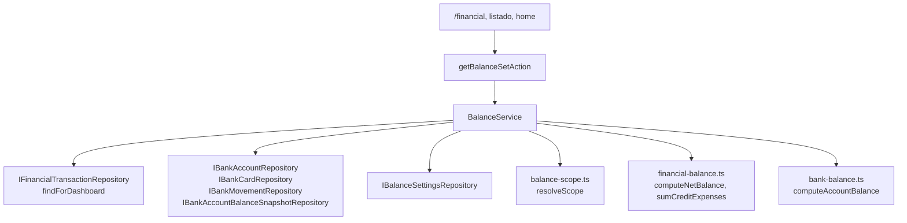

# Balances configurables — diseño

**Fecha:** 2026-08-27
**Estado:** pendiente de revisión del usuario
**Proyecto Supabase:** KyberLife (`xywkuwmhnfcdksamuypk`, us-east-2)

---

## 1. Problema

La app muestra hoy un solo número al que llama "balance", y ese número responde a una sola
pregunta: *¿cuánto me quedó del presupuesto de este rango?* Sale de `computeNetBalance`
—ingresos, menos gastos reales, menos transferencias a ahorros, más fondeos— sobre las
transacciones activas del rango seleccionado.

Faltan dos preguntas que el usuario necesita responder a diario:

- **¿Cuánto dinero tengo?** El módulo Bancos ya sabe el saldo de cada cuenta
  (`computeAccountBalance` = último snapshot declarado más los movimientos posteriores), pero
  ese total vive en `/financial/banks` y no está disponible como "balance" en las pantallas
  donde el usuario mira su situación.
- **¿Y si contara ya lo que gasté con tarjeta?** Existe como un toggle binario
  ("Incluir TC") en el hero de `/financial` y en el resumen del listado, desconectado del
  concepto de balance y sin explicación de qué hace.

Además, el balance del periodo cuenta **todas** las cuentas. No hay forma de decir "la cuenta
de la empresa no es mi presupuesto" o "el ahorro de los niños no cuenta", que es exactamente
lo que hace falta cuando un mismo usuario tiene cuentas con propósitos distintos.

Y no hay forma de saber cuál de las tres preguntas responde el número que se está mirando.

## 2. Alcance

Tres balances, un selector para moverse entre ellos en toda pantalla que muestre uno, y una
configuración en ajustes que decide qué cuentas y tarjetas alimentan dos de los tres.

**Fuera de alcance:** declarar saldo de efectivo (no existe ninguna cuenta `CASH` hoy),
multi-moneda (todo es USD), y proyecciones a futuro.

## 3. Decisiones tomadas

| Pregunta | Decisión |
|---|---|
| ¿Qué entra en el Balance Total? | Suma de saldos de cuentas confirmadas y activas, más efectivo. La deuda de tarjetas **no** resta: se muestra aparte. |
| ¿Qué resta el Balance Con Tarjetas? | Los consumos con tarjeta del rango — exactamente lo que hace hoy el toggle "Incluir TC". |
| Transacciones sin cuenta ligada | Entran siempre. El filtro solo saca lo que está explícitamente ligado a algo excluido. |
| Cuentas nuevas en un banco incluido | Heredan del banco. Se guardan solo las excepciones. |
| Cuentas activas sin saldo declarado | Quedan fuera del Total, con aviso visible. |
| ¿Una configuración o una por balance? | Una sola, compartida por Periodo y Con Tarjetas. |
| ¿El Total respeta el filtro? | No. Siempre suma todo. |
| ¿El selector recuerda la elección? | No. Cada carga arranca en el balance por defecto de ajustes. |
| ¿El Total sigue el rango de fechas? | No. Es el saldo de hoy y el tooltip lo dice. |
| Transferencia con una punta excluida | Cuenta como movimiento real: sale si el destino está excluido, entra si lo está el origen. |
| Árbol de configuración | Banco desplegable con sus cuentas y tarjetas juntas. |

### Por qué el Total ignora el filtro

El Total responde a un hecho, no a una decisión de presupuesto. Si el usuario excluye un banco
porque no lo presupuesta, ese dinero sigue siendo suyo y espera verlo al preguntar cuánto
tiene. Que el filtro lo recortara produciría el peor resultado posible: la app diciendo una
cifra y el banco otra, sin forma de saber cuál creer. El filtro decide qué se presupuesta, no
qué se posee. A cambio, el Total ofrece desglose por banco.

## 4. Los tres balances

### 4.1 Total — "cuánto tengo"

```
total = Σ saldo(cuenta)   para toda cuenta con
          is_deleted = false
          status = 'ACTIVE'
          is_unconfirmed = false
          y al menos un snapshot declarado
```

Incluye la cuenta de tipo `CASH` si existe. No aplica el scope, no depende del rango, no resta
deuda de tarjeta.

Las cuentas sin snapshot quedan **fuera**. Hoy `computeAccountBalance` las calcula como
"cero más movimientos", que en una cuenta con gastos registrados y ningún ingreso produce un
negativo falso. Tres de las nueve cuentas contables del usuario están en ese caso. Excluirlas
y avisar es la única lectura honesta: el número dice lo que se sabe, y el aviso dice qué falta
por saber.

Metadata que devuelve para la interfaz:

- `accountsCounted` — cuántas cuentas suma.
- `accountsWithoutSnapshot` — id y nombre de las excluidas, para el aviso.
- `creditDebt` — deuda acumulada de las tarjetas, como dato secundario nunca restado.

### 4.2 Periodo — "mi presupuesto del rango"

Sobre las transacciones activas del rango (`CONFIRMED`, `REVIEWED`, `MANUAL`), con
`paidWithCredit` ya resuelto por `isTransactionPaidWithCredit`. Por transacción:

| Caso | Aporte |
|---|---|
| Ligada a una cuenta o tarjeta excluida, **salvo transferencias** | se ignora entera |
| Sin ninguna cuenta ni tarjeta ligada | entra, según su tipo |
| Ingreso, depósito o reembolso | `+ monto` |
| Retiro de cajero | `0` — el dinero cambia de forma, sigue disponible |
| Transferencia con categoría *Ahorros e Inversiones* | `− monto` |
| Transferencia con categoría *Fondeo ingresos* | `+ monto` |
| Transferencia de cuenta incluida a cuenta excluida | `− monto` |
| Transferencia de cuenta excluida a cuenta incluida | `+ monto` |
| Resto de transferencias | `0` |
| Gasto con `paidWithCredit` | `0` — diferido hasta que se pague la tarjeta |
| Gasto normal | `− monto` |

Las reglas de categoría se evalúan **antes** que las de scope. Una transferencia dirigida a
*Ahorros e Inversiones* cuyo destino además esté excluido resta una vez, no dos.

### 4.3 Con tarjetas

```
conTarjetas = periodo − Σ monto de los gastos del rango con paidWithCredit
                          cuya tarjeta esté incluida, o que no tengan tarjeta ligada
```

Reemplaza el toggle "Incluir TC", que se retira del hero de `/financial` y del resumen del
listado. Pasar de Periodo a Con Tarjetas es el mismo gesto que hacía el toggle; mantener los
dos controles dejaría dos formas de expresar lo mismo y la posibilidad de contradecirse.

## 5. Resolución del scope

Función pura en `src/domain/services/balance-scope.ts`:

```ts
resolveScope(rules: readonly BalanceScopeRule[]): BalanceScope
```

`BalanceScope` expone `isAccountIncluded(id)`, `isCardIncluded(id)` y
`isTransactionIncluded(tx)`. La resolución tiene tres pasos:

1. Todo está incluido mientras no exista una regla que diga lo contrario.
2. Una regla de `INSTITUTION` con `included = false` excluye ese banco entero, cuentas y
   tarjetas.
3. Una regla de `ACCOUNT` o `CARD` gana sobre la de su banco, en los dos sentidos: rescata una
   cuenta de un banco excluido, o saca una cuenta de un banco incluido.

Una regla cuyo objetivo ya no existe se ignora. No afecta a ningún cálculo, y no justifica
mantener triggers de limpieza sobre tres tablas.

`isTransactionIncluded` mira `bankSourceAccountId`, `bankDestinationAccountId` y `bankCardId`.
Si ninguno está poblado, la transacción entra: es la regla de huérfanas. Si alguno apunta a
algo excluido, queda fuera — salvo el caso de transferencia de la tabla anterior, donde una
punta excluida cambia el signo en vez de descartar la fila.

## 6. Arquitectura



### 6.1 Archivos

| Archivo | Rol |
|---|---|
| `src/domain/entities/balance.ts` | `BalanceMode`, `BalanceScopeRule`, `BalanceSettings` |
| `src/domain/services/balance-scope.ts` | `resolveScope`, puro |
| `src/domain/services/financial-balance.ts` | extendido con el parámetro `scope` |
| `src/domain/repositories/balance.ts` | `IBalanceSettingsRepository` |
| `src/infrastructure/repositories/supabase/supabase-balance-settings-repository.ts` | implementación Supabase |
| `src/infrastructure/repositories/implementations.ts` | implementación en memoria |
| `src/application/services/balance-service.ts` | compone los tres balances |
| `src/app/actions/balance.ts` | server actions |
| `src/presentation/financial/components/BalanceModeSwitch.tsx` | selector compartido |
| `src/presentation/financial/components/settings/BalanceScopeManager.tsx` | árbol de ajustes |

### 6.2 El scope entra en `computeNetBalance`, no en una función nueva

La firma pasa a `computeNetBalance(transactions, categoryNameById?, scope?)`. Sin `scope` se
comporta igual que hoy, de modo que todo el código y los tests existentes siguen válidos.

Esto es deliberado. El bug que se corrigió el 2026-08-26 —listado y resumen mostrando balances
distintos— existió porque había dos formas de resolver `paidWithCredit`. Una función paralela
`computePeriodBalance` que replicara las reglas de ingresos, ahorros y fondeos sería el mismo
error otra vez, con el mismo desenlace.

### 6.3 `BalanceService` lee de los repositorios, no de `BankService.getOverview`

`getOverview` llama a `closeDueStatements`, que cierra estados de cuenta vencidos: tiene efecto
secundario. Un servicio de lectura invocado desde tres pantallas no puede mutar datos al ser
consultado. `BalanceService` toma cuentas, tarjetas, movimientos y snapshots de sus
repositorios y calcula con las funciones puras de `bank-balance.ts`.

### 6.4 Contrato

```ts
getBalanceSet(userId: UUID, range: { startDate?: Date; endDate?: Date }): Promise<BalanceSet>

interface BalanceSet {
    defaultMode: BalanceMode;
    currency: string;
    total: {
        value: number;
        accountsCounted: number;
        accountsWithoutSnapshot: { id: string; name: string }[];
        creditDebt: number;
    };
    period: {
        value: number;
        income: number;
        expenses: number;
        savings: number;
        funding: number;
        excludedCount: number;
    };
    withCredit: {
        value: number;
        creditDeferred: number;
    };
}
```

Cada bloque lleva los componentes de su propio tooltip: el número y las partes de las que sale,
no una cadena de texto prefabricada. Una sola llamada alimenta las tres opciones del selector,
así que cambiar de balance no vuelve al servidor.

## 7. Esquema

```sql
CREATE TABLE financial_balance_settings (
    owner_user_id uuid PRIMARY KEY REFERENCES auth.users(id) ON DELETE CASCADE,
    default_mode  text NOT NULL DEFAULT 'PERIOD'
                  CHECK (default_mode IN ('TOTAL','PERIOD','PERIOD_WITH_CREDIT')),
    created_at    timestamptz NOT NULL DEFAULT now(),
    updated_at    timestamptz NOT NULL DEFAULT now()
);

CREATE TABLE financial_balance_scope_rules (
    id            uuid PRIMARY KEY DEFAULT gen_random_uuid(),
    owner_user_id uuid NOT NULL REFERENCES auth.users(id) ON DELETE CASCADE,
    target_type   text NOT NULL CHECK (target_type IN ('INSTITUTION','ACCOUNT','CARD')),
    target_id     uuid NOT NULL,
    included      boolean NOT NULL,
    created_at    timestamptz NOT NULL DEFAULT now(),
    updated_at    timestamptz NOT NULL DEFAULT now(),
    UNIQUE (owner_user_id, target_type, target_id)
);

CREATE INDEX ON financial_balance_scope_rules (owner_user_id);
```

RLS por dueño en ambas, siguiendo el patrón del resto del esquema.

`target_id` no lleva clave foránea porque apunta a tres tablas distintas según `target_type`.
La contrapartida es que puede quedar apuntando a algo borrado, y el resolver la ignora
(sección 5).

Sin fila en `financial_balance_settings` el usuario tiene el comportamiento por defecto:
modo `PERIOD` y todo incluido. No hay que sembrar nada al registrarse, y la tabla solo se
escribe cuando el usuario configura algo.

## 8. Interfaz

### 8.1 El selector

La etiqueta del balance se convierte en el control. Donde hoy dice "Balance actual" pasa a
decir `Balance del periodo ⌄`. Al tocarla se abre un popover con las tres opciones; cada una
muestra su nombre, su valor ya calculado y una línea que explica de dónde sale:

> **Total** · $4.812,30 — Suma de los saldos de tus 6 cuentas con saldo declarado. No depende
> del rango ni de tu configuración.
>
> **Del periodo** · $4.709,46 — Ingresos menos gastos reales del 22 ago – 21 sep, restando
> ahorros y sumando fondeos. Los consumos con tarjeta no cuentan hasta que pagas.
>
> **Con tarjetas** · $4.510,77 — Igual que el anterior, restando además $198,69 de consumos con
> tarjeta del periodo.

Un solo gesto cubre las tres necesidades: cambiar de balance, explicar el cálculo y ver los
tres números a la vez, que es lo que uno quiere cuando duda de una cifra.

El componente es único, `BalanceModeSwitch`, con dos tamaños: `hero` para la tarjeta grande de
`/financial`, y `compact` para el chip del listado y la tarjeta del home. Ocupa lo mismo que la
etiqueta que ya está ahí —dos palabras y un chevron— así que cabe en las tres superficies sin
rediseñarlas.

Superficies afectadas:

| Pantalla | Componente | Hoy | Después |
|---|---|---|---|
| `/financial` | `BalanceHeroCard` | `netBalance` + toggle "Incluir TC" | balance elegido + selector |
| Listado | `TransactionSummary` | chip "Balance" + toggle "Incluir TC" | chip con selector |
| Home | `HomeDesktop` / `HomeMobile` | `monthNet` y `totalBalance` en tarjetas separadas | la tarjeta de `monthNet` lleva el selector; la de `totalBalance` se retira, porque el Total pasa a ser una de las tres opciones y tenerlo dos veces en la misma pantalla confunde |

En modo Total aparece bajo el número una línea discreta —*"3 cuentas sin saldo declarado"*—
enlazada al tablero de saldos. Sin ella el número miente por omisión y no hay forma de notarlo.

El desglose fino de componentes sigue yendo al `KpiBreakdownModal` que ya existe.

### 8.2 Ajustes

`/financial/settings` pasa de dos pestañas a tres, con una nueva llamada **Balances**:

- **Balance por defecto** — las tres opciones con la misma explicación de una línea.
- **Qué entra en el balance** — lista de bancos; cada uno se despliega y muestra sus cuentas y
  tarjetas juntas, con casilla. El banco cerrado resume su estado: *"Pichincha · 3 de 4
  incluidas"*. Tres estados visuales: incluido, excluido, parcial.
- **Restablecer** — borra todas las reglas y vuelve a "todo incluido".

Alternar la casilla de un banco **borra las excepciones que tuviera dentro**. Si el usuario
excluye un banco entero y luego lo vuelve a incluir, entra limpio. De lo contrario arrastraría
excepciones invisibles en la interfaz que explicarían un número extraño meses después.

## 9. Pruebas

| Nivel | Archivo | Qué cubre |
|---|---|---|
| Dominio | `__tests__/domain/balance-scope.test.ts` | herencia de banco a cuenta; excepción que rescata una cuenta de un banco excluido; excepción que saca una cuenta de un banco incluido; regla apuntando a algo borrado |
| Dominio | `__tests__/domain/balance-modes.test.ts` | los tres cálculos; transferencia con una punta excluida en ambos sentidos; huérfanas dentro; cuentas sin snapshot fuera del total; categoría antes que scope |
| Aplicación | `__tests__/services/balance-service.test.ts` | composición del `BalanceSet` y su metadata |
| Componentes | `__tests__/components/balance-mode-switch.test.tsx` | el selector cambia el número y lista los tres valores |
| Componentes | `__tests__/components/balance-scope-manager.test.tsx` | estado parcial del banco; alternar el banco limpia sus excepciones |
| Regresión | `__tests__/integration/balance-parity.test.ts` | **sin ninguna regla, el balance del periodo es idéntico al `netBalance` actual** |

La prueba de regresión es la red de seguridad: garantiza que este trabajo no mueve ningún
número existente hasta que el usuario configure algo.

## 10. Orden de trabajo

1. Dominio puro: `balance-scope.ts`, extensión de `financial-balance.ts`, y sus tests.
2. Esquema, migración y repositorios (Supabase y en memoria), con el cableado en
   `container.ts`.
3. `BalanceService` y las server actions.
4. `BalanceModeSwitch` y las tres superficies.
5. Pestaña Balances en ajustes.
6. Retirar el toggle "Incluir TC" y sus utilidades ya sin uso en
   `presentation/financial/lib/credit-toggle.ts`.

## 11. Riesgos

- **Coste de lectura.** El Total necesita todos los movimientos bancarios del usuario para
  reconstruir saldos. Hoy son cientos de filas y la lectura es directa, pero es la consulta que
  crecerá primero. Si llega a molestar, el camino es materializar el saldo por cuenta en
  `bank_accounts` al escribir movimientos, no paginar aquí.
- **El paso 6 cambia números en pantalla.** Retirar el toggle no altera ningún cálculo, pero un
  usuario que lo tuviera encendido verá el balance del periodo donde antes veía el de tarjetas
  hasta que cambie el balance por defecto en ajustes.
