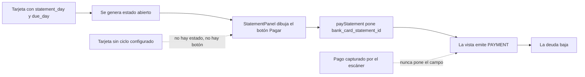

# Pago de tarjetas de crédito — diseño

**Fecha:** 2026-09-05
**Estado:** pendiente de revisión del usuario
**Proyecto Supabase:** KyberLife (`xywkuwmhnfcdksamuypk`, us-east-2)

---

## 1. Problema

La deuda de una tarjeta de crédito nunca baja. Sube con cada consumo y ahí se queda, aunque el
usuario haya pagado y la app tenga el pago guardado.

La deuda se calcula en `computeCardDebt` (`src/domain/services/bank-balance.ts`) como
`Σ CHARGE − Σ PAYMENT` sobre la vista `bank_movements`. En esa vista un `PAYMENT` existe bajo
una sola condición: que la transacción traiga `bank_card_statement_id`.

```sql
SELECT t.id, …, s.card_id, 'PAYMENT', t.amount, …
  FROM financial_transactions t
  JOIN bank_card_statements s ON s.id = t.bank_card_statement_id
```

Ese campo solo lo pone `BankService.payStatement`, al que se llega por un único camino:
el botón de `StatementPanel`, que se dibuja solo si la tarjeta tiene estado abierto. Y un
estado abierto solo se genera para tarjetas que declaren `statement_day` y `due_day`.

La cadena completa, y dónde se rompe:



Las dos flechas punteadas son el problema, y las dos se dan hoy en la base:

- **Los pagos reales no llegan por ese camino.** No existe ni una transacción de tipo
  `PAYMENT` en la base. Los pagos de tarjeta están capturados como `EXPENSE` (366 filas) y
  `TRANSFER` (70), y ninguna de las 493 transacciones vivas tiene `bank_card_statement_id`.
- **El botón es inalcanzable para las tarjetas que importan.** La Mastercard del Banco del
  Pacífico acumula $534,56 de deuda y no tiene ciclo configurado, así que no tiene estado
  abierto y la pantalla no ofrece forma alguna de pagarla.

## 2. Alcance

Entra:

- Atar un pago a una tarjeta sin depender de que exista un estado de cuenta.
- Detectar automáticamente, entre las transacciones ya capturadas, las que son pagos a una
  tarjeta identificable, y confirmarlas en una bandeja antes de que toquen la deuda.
- Un botón de pago en el detalle de tarjeta que funcione con o sin estado abierto, y que sirva
  también como "marcar como pagada".

No entra:

- Repartir un mismo pago entre varios estados de cuenta.
- Pagos en moneda distinta a la de la tarjeta.
- Intereses, pago mínimo y mora.
- Detectar el pago en el momento de capturar, desde el wizard o la voz.

## 3. Decisiones tomadas

| Decisión | Alternativa descartada | Por qué |
|---|---|---|
| El pago tiene dos patas: baja la deuda de la tarjeta y debita la cuenta de origen | Solo una de las dos | Es lo que ocurre de verdad; y la pata de la cuenta ya funciona hoy sin tocar nada |
| Detección automática **con confirmación** en una bandeja | Atar solo; o atar todo a mano | Reusa la maquinaria de huellas ya construida, y ningún pago mueve la deuda sin que el usuario lo vea |
| Solo entran a la bandeja los pagos con **número de tarjeta legible** | Aceptar también los que solo nombran el banco | Precisión sobre cobertura: nada baja la deuda por parecido de descripción. Coste asumido en §9 |
| "Marcar como pagada" **registra un pago desde una cuenta** | Un ajuste que ponga la deuda en cero sin origen | Un saldo que se corrige sin decir de dónde salió el dinero infla los saldos de las cuentas |
| Un pago abona **primero el estado abierto**, y el resto baja la deuda corriente | Todo a la deuda; o todo al estado | Deja un solo flujo de pago, y funciona igual con tarjetas sin ciclo configurado |
| Las candidatas gemelas **se agrupan** y se ata una sola | Confirmarlas por separado y avisar después | Hay 8 pares reales en la base; atar los dos lados restaría la deuda dos veces |
| Columna nueva `bank_card_payment_id` | Reusar `bank_card_id` con `paid_with_credit = false` | Ver §4.1 |

## 4. Modelo de datos

### 4.1 Por qué una columna nueva y no reusar `bank_card_id`

Hoy `bank_card_id` significa "con esta tarjeta se pagó". La vista lo traduce a `CHARGE` cuando
la tarjeta es de crédito y `paid_with_credit` es verdadero. Sería tentador declarar que la
misma columna, con `paid_with_credit = false`, significa "a esta tarjeta se le pagó" — y hoy
funcionaría, porque el reparto en la base está limpio:

| `card_type` | `paid_with_credit` | filas |
|---|---|---|
| CREDIT | true | 81 |
| DEBIT | false | 75 |

No hay una sola fila CREDIT + false. Pero eso es una propiedad accidental de los datos de hoy,
no una garantía. La columna pasaría a significar dos cosas opuestas —con qué tarjeta pagué, y
a qué tarjeta le pagué— distinguidas por un booleano que sirve para otra cosa. El día que una
compra a crédito entre con el flag mal puesto, se convierte en un pago en silencio y la deuda
baja sola, sin nada que lo señale.

### 4.2 La migración

```sql
ALTER TABLE financial_transactions
    ADD COLUMN bank_card_payment_id  UUID REFERENCES bank_cards(id) ON DELETE SET NULL,
    ADD COLUMN card_payment_dismissed_at TIMESTAMPTZ;

CREATE INDEX financial_transactions_bank_card_payment_id_idx
    ON financial_transactions (bank_card_payment_id)
    WHERE bank_card_payment_id IS NOT NULL;

-- No se paga una tarjeta con el crédito de esa misma tarjeta.
ALTER TABLE financial_transactions
    ADD CONSTRAINT financial_transactions_payment_not_on_credit
    CHECK (bank_card_payment_id IS NULL OR COALESCE(paid_with_credit, FALSE) = FALSE);
```

`bank_card_payment_id` significa una sola cosa: esta transacción es dinero que fue **a** esa
tarjeta. `card_payment_dismissed_at` recuerda que el usuario ya miró esa candidata y dijo que
no, para que la bandeja no se la vuelva a ofrecer; es un descarte, no un borrado.

### 4.3 La vista `bank_movements`

La rama `PAYMENT` se reescribe. La forma importa: **no** son dos ramas.

```sql
-- Pago a una tarjeta: baja su deuda. La salida de la cuenta pagadora entra por
-- la rama de gastos, como cualquier otro pago.
SELECT t.id, t.owner_user_id, t.date,
       NULL::UUID AS account_id,
       COALESCE(t.bank_card_payment_id, s.card_id) AS card_id,
       'PAYMENT'::TEXT, t.amount, t.currency,
       t.description, t.merchant, t.category_id
  FROM financial_transactions t
  LEFT JOIN bank_card_statements s ON s.id = t.bank_card_statement_id
 WHERE COALESCE(t.bank_card_payment_id, s.card_id) IS NOT NULL
   AND t.status NOT IN ('REJECTED', 'DELETED', 'DUPLICATE');
```

Un `LEFT JOIN` con `COALESCE`, no una rama nueva unida con `UNION ALL`. Un pago que abona un
estado lleva las dos columnas puestas (§5), y con dos ramas emitiría dos filas `PAYMENT`:
restaría la deuda por duplicado. Esta forma emite exactamente una fila por transacción.

El resto de la vista no cambia. En particular, la pata que debita la cuenta ya funciona: un
pago con `bank_source_account_id` cae en la rama de gastos —no es INCOME, ni TRANSFER, ni
WITHDRAWAL, y no está pagado con crédito— y sale como `OUT`. Las dos patas del pago salen de
la misma fila.

## 5. Reparto de un pago

Función pura en `src/domain/services/bank-balance.ts`:

```ts
export function allocatePayment(
    amount: number,
    openStatement: BankCardStatement | null,
): { toStatement: number; toDebt: number };
```

`toStatement = min(amount, computeStatementDue(openStatement))`, y `toDebt` es el resto. Sin
estado abierto, todo va a `toDebt`.

`BankService.payCard(userId, cardId, sourceAccountId, amount, date)` la usa así:

1. Carga la tarjeta y su estado abierto, si lo hay.
2. Reparte con `allocatePayment`.
3. Crea **una** transacción `PAYMENT` con `bank_card_payment_id = cardId`,
   `bank_source_account_id`, y `bank_card_statement_id` solo si `toStatement > 0`.
4. Si `toStatement > 0`, suma esa parte a `paid_amount` del estado y lo pasa a `PAID` cuando
   queda saldado.

Con una tarjeta sin ciclo configurado, los pasos 1, 2 y 4 no hacen nada visible y el pago
entero baja la deuda. Es el caso de la Mastercard de hoy.

`payStatement` desaparece: `payCard` lo cubre, y dejar los dos vivos sería dejar dos formas de
pagar que pueden divergir.

## 6. Detección

Funciones puras en `src/domain/services/card-payment-detection.ts`. Sin base de datos, sin
repositorios: reciben transacciones y tarjetas, devuelven grupos.

### 6.1 Filtro de intención

El español de los bancos usa la misma palabra para las dos direcciones del dinero, y la
diferencia está en una preposición:

| Descripción real | Qué es |
|---|---|
| `Pago de tarjeta de crédito` | pago **a** la tarjeta |
| `Pago de la tarjeta de crédito No. 4697XXXXXXXX9620` | pago **a** la tarjeta |
| `Pago de TC Mastercard` | pago **a** la tarjeta |
| `Pago mínimo de tarjeta de crédito` | pago **a** la tarjeta |
| `Pago realizado a tarjeta MASTERCARD` | pago **a** la tarjeta |
| `Pago con tarjeta de débito` | una **compra** |
| `Pago realizado con tarjeta de débito` | una **compra** |
| `Pago de préstamos Brian por uso de tarjeta en Arg` | ni lo uno ni lo otro |

Dos listas de patrones, una de inclusión y otra de exclusión, con la exclusión ganando. Son
datos exportados, no lógica enterrada, y cada frase de la tabla es un caso de test.

### 6.2 Extracción del número

Del texto de la descripción, y del `origin_stats->>'emailBody'` cuando la transacción viene de
un escaneo, se extrae el primer token con forma de número de tarjeta: `4697XXXXXXXX9620`,
`XXXX8361`, `493176******1234`. Se parsea con `parseBankNumber` (`src/lib/bank-number-fingerprint.ts`)
y se resuelve contra las tarjetas de crédito del usuario con `areCompatible`
(`src/lib/bank-number-match.ts`). Es la misma maquinaria que ya resuelve identidades en la
conciliación; no se escribe un segundo emparejador.

Si no hay número, o el número no resuelve a exactamente una tarjeta, la transacción **no entra
a la bandeja**. Ninguna candidata llega por parecido de descripción.

### 6.3 Agrupación de gemelas

Las candidatas que resuelven a la misma tarjeta, con el mismo monto y fechas a menos de 3 días
de distancia, forman un grupo y se confirman una sola vez. En la base hay ocho pares así:

| Fecha | Monto | Filas | ¿Marcadas como duplicado? |
|---|---|---|---|
| 2026-08-06 | 481,61 | 2 | no |
| 2026-07-23 | 1264,18 | 2 | no |
| 2026-06-23 | 3,25 | 2 | no |
| 2026-06-22 | 36,00 | 2 | no |
| 2026-06-22 | 1020,19 | 2 | no |
| 2026-05-25 | 1075,00 | 2 | no |
| 2026-05-25 | 1075,21 | 2 | no |
| 2026-05-23 | 2184,00 | 2 | no |

Es el mismo pago visto dos veces —el correo del banco y el estado de cuenta—, y el flag
`possible_duplicate` no los marcó. Al confirmar un grupo se ata la fila que traiga
`bank_source_account_id`, porque es la que sabe de dónde salió el dinero; con empate, la más
antigua. Las demás quedan con `possible_duplicate = true` y sin atar. No se borra ninguna: la
segunda fuente a veces trae datos que la primera no tiene.

## 7. Interfaz

### 7.1 Detalle de tarjeta

```
  Mastercard XXXX8361
  Banco del Pacífico · XXXX8361

  ┌────────────────────────────────────────┐
  │ Deuda total                            │
  │ $534,56                    [ Pagar ]   │
  │ Cupo libre $1.465,44                   │
  └────────────────────────────────────────┘

  PAGOS POR CONFIRMAR (1)
  ┌────────────────────────────────────────┐
  │ $481,61 · 6 ago · 2 registros          │
  │ "Pago de tarjeta de crédito"           │
  │ leído XXXX8361 → Mastercard XXXX8361   │
  │ [Confirmar]  [Cambiar]  [Descartar]    │
  └────────────────────────────────────────┘

  CONSUMOS DEL PERÍODO
  …
```

El botón **Pagar** aparece siempre que la tarjeta sea de crédito y `debt > 0`, sin depender de
que haya estado abierto — que es justo lo que hoy lo esconde. Abre un sheet con cuenta de
origen (preseleccionada la única no-efectivo cuando hay una sola), monto precargado con la
deuda total y editable, y fecha de hoy. **"Marcar como pagada" es ese mismo sheet con el monto
ya puesto en el total**: un atajo, no una contabilidad aparte.

`StatementPanel` conserva su botón, pero llama a `payCard`. Los dos caminos crean la misma
transacción y aplican el mismo reparto.

### 7.2 Bandeja

Ruta `/financial/banks/payments`, con el lenguaje visual de `/financial/banks/reconcile`. Un
bloque por grupo, con el monto, la fecha, la descripción cruda, el número que se leyó, la
tarjeta propuesta con su evidencia y la cuenta de origen si la hay. Tres acciones: confirmar,
cambiar tarjeta (selector con las de crédito del usuario) y descartar. El resumen de Bancos
lleva un contador que enlaza aquí cuando hay pendientes.

## 8. Capas y archivos

| Capa | Archivo | Qué |
|---|---|---|
| Migración | `supabase/migrations/20260905120000_card_payments.sql` | columnas, índice, CHECK, vista `bank_movements` |
| Dominio | `domain/entities/financial.ts` | `bankCardPaymentId`, `cardPaymentDismissedAt` |
| Dominio | `domain/services/bank-balance.ts` | `allocatePayment` |
| Dominio | `domain/services/card-payment-detection.ts` | intención, número, agrupación |
| Aplicación | `application/services/bank-service.ts` | `payCard`, `listPendingCardPayments`, `confirmCardPayment`, `dismissCardPayment`; se borra `payStatement` |
| Infra | `repositories/supabase/…` y `repositories/implementations.ts` | los dos lados, como exige el container |
| Validación | `lib/validators/bank-schemas.ts` | esquemas de las acciones nuevas |
| Actions | `app/actions/bank.ts` | `payCardAction`, `confirmCardPaymentAction`, `dismissCardPaymentAction`; se borra `payStatementAction` |
| UI | `presentation/bank/components/` | `PayCardSheet`, `PendingPaymentsList`; cambios en `CardDetailClient` y `StatementPanel` |
| UI | `app/financial/banks/payments/page.tsx` | la bandeja |

## 9. Tests

Lo que se prueba de verdad es dominio puro, sin base ni jsdom.

- `__tests__/domain/bank-balance.test.ts` — `allocatePayment`: estado que absorbe todo el pago;
  estado que absorbe parte y deja resto; sin estado abierto; pago mayor que la deuda.
- `__tests__/domain/card-payment-detection.test.ts` — las ocho descripciones de la tabla §6.1,
  incluidas las tres trampas: "Pago con tarjeta de débito" y el préstamo de Brian no son pagos;
  "Pago de tarjeta de crédito" sin número sí es un pago, pero no entra por falta de número.
  Extracción de las tres formas de número. Agrupación con los ocho pares reales de §6.3, y no
  agrupación cuando cambia la tarjeta, el monto o la fecha se separa más de 3 días.
- `__tests__/services/bank-service.test.ts` — `payCard` crea una sola transacción y abona el
  estado cuando lo hay; `confirmCardPayment` ata una sola fila del grupo y marca las demás como
  duplicadas; `dismissCardPayment` saca la candidata de la bandeja sin borrarla.
- `__tests__/components/CardDetailClient.test.tsx` — el botón Pagar aparece con deuda y sin
  estado abierto; el sheet precarga la deuda total.

## 10. Riesgos

- **Los pagos sin número quedan fuera de la detección.** De las 20 candidatas de la base, solo
  3 traen número; las 17 restantes solo nombran el banco, y entre ellas están todas las del
  Banco del Pacífico — el emisor de la Mastercard con $534,56. Esa deuda se salda a mano con el
  botón nuevo. Es consecuencia directa de la regla elegida (§3), no un descuido.
- **Cambiar la rama PAYMENT altera la deuda de cualquier tarjeta que ya tuviera pagos por
  estado.** Hoy no hay ninguna: cero transacciones con `bank_card_statement_id`. El cambio es
  inocuo sobre los datos actuales, y se verificó antes de escribir esto.
- **Las frases son específicas del español de estos bancos.** Un emisor con otra redacción no
  se detecta hasta que se añada su patrón. Por eso las listas son datos exportados y con test,
  no expresiones enterradas en una función.
- **El CHECK puede rechazar escrituras existentes.** Ningún camino actual pone
  `bank_card_payment_id`, así que no hay filas que violen la restricción; pero cualquier código
  futuro que ate un pago debe poner `paid_with_credit = false` explícitamente.
